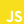

### <h3 align="center">Hi there, I'm `Sebastian`</h3>

> SKILLS  &nbsp;  &nbsp;  &nbsp;    &nbsp;  &nbsp;  &nbsp; 
> &nbsp;  &nbsp;  &nbsp;  &nbsp;  &nbsp;  &nbsp; 
&nbsp;  &nbsp;  &nbsp;  &nbsp;  &nbsp;  &nbsp;   
##

